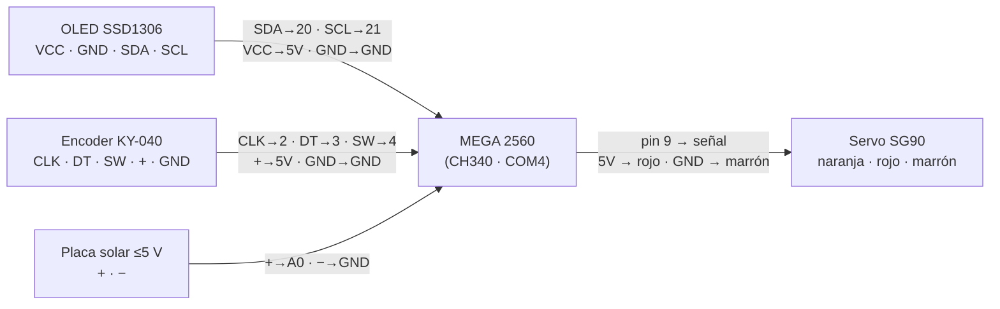
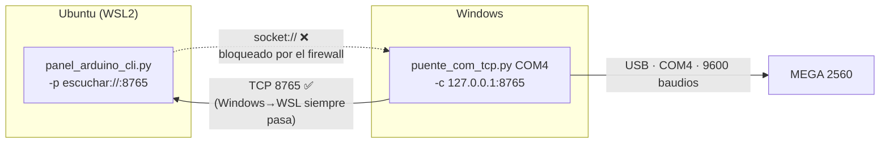

# Manual — Estación MEGA 2560

Cómo montar, programar y controlar desde Ubuntu (WSL) el Arduino MEGA 2560 con
pantalla OLED, encoder rotativo, servo SG90 y placa solar — **sin permisos de
administrador en Windows**.

> Versión web ilustrada del manual: página privada en Claude Artifacts
> (pídele el enlace al autor). Este documento es la versión de referencia del repo.

## Índice

1. [Material necesario](#1-material-necesario)
2. [Cableado del MEGA](#2-cableado-del-mega)
3. [Cargar el programa](#3-cargar-el-programa)
4. [La cadena de conexión](#4-la-cadena-de-conexión)
5. [Paso a paso: Windows](#5-paso-a-paso-windows)
6. [Paso a paso: WSL](#6-paso-a-paso-wsl)
7. [Comandos disponibles](#7-comandos-disponibles)
8. [Solución de problemas](#8-solución-de-problemas)
9. [Extra: el Arduino UNO](#9-extra-el-arduino-uno)

---

## 1. Material necesario

- **Arduino MEGA 2560** — clon azul con chip USB CH340.
- **Pantalla OLED SSD1306** 128×64, I²C (4 pines: VCC, GND, SDA, SCL).
- **Encoder rotativo KY-040** (pines CLK, DT, SW, +, GND).
- **Servo SG90** (cables naranja / rojo / marrón).
- **Placa solar pequeña** de ≤ 5 V.
- Cable USB-B, cables dupont.
- En el PC: Windows con WSL2 (Ubuntu), Python en ambos lados y esta carpeta
  `arduino/` del repo.

## 2. Cableado del MEGA

| Componente | Pin del componente | Pin del MEGA |
|---|---|---|
| OLED SSD1306 | VCC | `5V` |
| | GND | `GND` |
| | SDA | `20 (SDA)` |
| | SCL | `21 (SCL)` |
| Encoder KY-040 | CLK | `2` |
| | DT | `3` |
| | SW (pulsador) | `4` |
| | + | `5V` |
| | GND | `GND` |
| Servo SG90 | Naranja (señal) | `9` |
| | Rojo (+) | `5V` |
| | Marrón (−) | `GND` |
| Placa solar | Positivo | `A0` |
| | Negativo | `GND` |



> ⚠️ **La placa solar, siempre por debajo de 5 V.** Un panel pequeño da ~5 V en
> circuito abierto y no hay problema. Con uno mayor, usa un divisor de tensión
> (dos resistencias iguales en serie) y multiplica ×2 la lectura en el sketch.

## 3. Cargar el programa

El sketch es [`mega_panel_control/mega_panel_control.ino`](mega_panel_control/mega_panel_control.ino).
Se sube **desde el IDE de Arduino en Windows** (WSL no ve el USB directamente):

1. Instala el [IDE de Arduino](https://www.arduino.cc/en/software) (hay versión
   .zip portable si no tienes admin).
2. *Herramientas → Gestor de librerías*: instala **Adafruit SH110X** y
   **Adafruit GFX Library** (la de *Servo* ya viene incluida). El sketch
   viene configurado para pantallas con chip **SH1106** (`#define
   PANTALLA_SH1106`); si la tuya es una SSD1306 de 0.96", comenta esa
   línea e instala **Adafruit SSD1306** en su lugar.
3. Abre el `.ino`, elige placa **Arduino Mega or Mega 2560** y puerto **COM4**
   (el que diga *USB* / *CH340*).
4. Pulsa subir (→). Al terminar, la OLED muestra «Estacion lista».

> ✋ **Solo uno puede usar el COM a la vez.** Si el puente TCP está corriendo,
> ciérralo (Ctrl+C) antes de subir el sketch; si no, el IDE dirá que el puerto
> está ocupado.

## 4. La cadena de conexión

WSL no ve los USB de Windows, y la vía oficial (usbipd) pide administrador.
La solución sin admin es un **puente por red**: un script en Windows abre el
COM4 y lo sirve por TCP. Y como el firewall de Windows bloquea las conexiones
que *entran* desde WSL, usamos el **modo inverso**: la CLI de WSL escucha y es
el puente quien se conecta a ella — ese sentido siempre está permitido.



Con WSL en modo **mirrored** (`wslinfo --networking-mode` → `mirrored`),
Windows y WSL comparten localhost y el destino del puente es `127.0.0.1`.
En modo NAT sería la IP `172.x` de WSL — la CLI la imprime al arrancar.

## 5. Paso a paso: Windows

Solo la primera vez:

```powershell
pip install --user pyserial
python -m serial.tools.list_ports -v    # localiza el COM del MEGA
```

El puerto bueno es el **USB-SERIAL CH340** (p. ej. COM4). Ignora el
«Intel AMT-SOL (COM3)», que es un puerto interno de la placa base.

Cada sesión (con la CLI de WSL ya escuchando, ver §6):

```powershell
cd <repo>\arduino\ubuntu_app
python puente_com_tcp.py COM4 -c 127.0.0.1:8765
```

Salida esperada: `Modo inverso: conectando...` → `Conectado a 127.0.0.1:8765`.

## 6. Paso a paso: WSL

Solo la primera vez: `sudo apt install python3-serial`

Cada sesión (mejor antes que el puente, aunque el orden no es crítico —
el puente reintenta cada 2 s):

```bash
cd /mnt/c/<ruta-del-repo>/arduino/ubuntu_app
python3 panel_arduino_cli.py -p escuchar://:8765
```

La CLI imprime el comando exacto para Windows (con la IP ya puesta) y, al
conectar el puente, muestra `Puente conectado desde ...` y entra en el modo
interactivo.

## 7. Comandos disponibles

| Comando | Efecto |
|---|---|
| `estado` | Ángulo actual del servo y voltaje de la placa solar |
| `servo 0…180` | Mueve el servo a ese ángulo |
| `centrar` | Servo a 90° |
| `monitor` | Telemetría en vivo cada 100 ms (Ctrl+C para volver) |
| `crudo <texto>` | Envía texto tal cual por el puerto serie |
| `ayuda` / `salir` | Lista de comandos / terminar |

El hardware sigue vivo mientras tanto: el **encoder** mueve el servo, su
pulsador lo centra y la **OLED** muestra ángulo y voltaje en todo momento.

## 8. Solución de problemas

Todos reales — pasaron durante el montaje original:

| Síntoma | Causa | Arreglo |
|---|---|---|
| `usbipd no se reconoce…` | usbipd no está instalado y requiere admin | No lo necesitas: usa el puente TCP |
| `socket://… timed out` | El firewall de Windows corta WSL→Windows | Modo inverso: CLI `escuchar://:8765` + puente `-c` |
| El puente reintenta y nunca conecta | IP equivocada o la CLI no escucha aún | Arranca antes la CLI y copia el comando que imprime; en mirrored usa `127.0.0.1` |
| No sé qué COM es el Arduino | Varios puertos serie | `python -m serial.tools.list_ports -v` → el CH340 |
| El IDE no puede subir el sketch | El puente tiene el COM abierto | Ctrl+C al puente, sube, relanza |
| «No se encuentra la OLED» | Dirección I²C distinta o SDA/SCL cruzados | Revisa 20/21; si sigue, cambia `0x3C` por `0x3D` |
| La OLED muestra «nieve» (píxeles al azar) | El chip es SH1106, no SSD1306 — recibe alimentación pero ignora la imagen | Deja activo `#define PANTALLA_SH1106` e instala la librería **Adafruit SH110X**. Confírmalo antes con [`escaner_i2c/`](escaner_i2c/): si responde en 0x3C y aun así hay nieve, es esto |
| El servo tiembla o el MEGA se reinicia | El USB no da para los picos del servo | Si molesta, fuente externa de 5 V para el servo (GND común) |
| La IP de WSL cambió | WSL estrena IP en cada reinicio (NAT) | La CLI imprime la nueva al arrancar; en mirrored no aplica |

## 9. Extra: el Arduino UNO

El UNO tiene su propio sketch ([`uno_boton_led/`](uno_boton_led/)): pulsador +
LED en la protoboard y la misma OLED, con 4 modos de LED (botón físico o
comando `led 0…3` de la CLI).

| Componente | Pin del UNO |
|---|---|
| LED (ánodo, con resistencia 220 Ω) | `9` (cátodo a GND) |
| Pulsador | `2` y GND (pull-up interna) |
| OLED SDA / SCL | `A4` / `A5` (el UNO no tiene 20/21) |

Para controlar los dos Arduinos a la vez: segundo puente en otro puerto TCP —
`python puente_com_tcp.py COM5 -t 8766 -c 127.0.0.1:8766` en Windows y
`panel_arduino_cli.py -p escuchar://:8766` en otra pestaña de WSL.

---

*Protocolo serie a 9600 baudios. Sketches: [`mega_panel_control.ino`](mega_panel_control/mega_panel_control.ino)
y [`uno_boton_led.ino`](uno_boton_led/uno_boton_led.ino). Apps:
[`ubuntu_app/`](ubuntu_app/).*
